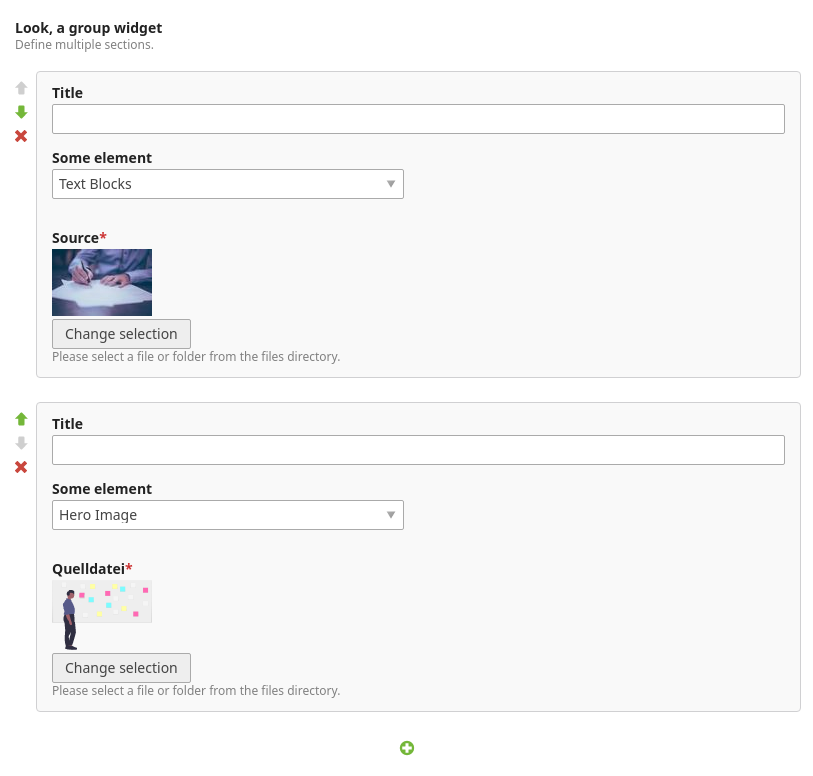

*This is an early version, changes are likely. Use with caution.*

# contao-group-widget

This Contao CMS extension provides a simple widget type `group` that allows
repeatable groups of fields in the backend. The resulting data is stored
as a serialized array.



#### Design + Limitations
The group widget does not alter the rendering and state of the displayed child
widgets for the sake of a broader compatibility. As a result, adding new
elements via the *plus* button will submit the current state to render + add a
new group instance.

Visual reordering of elements is done via the CSS `order` property. This way
`iframes` can be kept alive (the DOM won't change) which is especially helpful
when dealing with components like the `tinyMCE` rich text editor.

### DCA definition
Create your DCA and fields like you would without the group widget. Then add
the group field and replace your palette entries with it. 

```diff
- '{foo_legend},title,element_select,singleSRC;{bar_legend},other'
+ '{foo_legend},my_group_field;{bar_legend},other'
```

The repeated fields must be defined under the group field's `palette` key
instead. Additionally, a minimum/maximum number of allowed group elements can
be specified.

```php
$GLOBALS['TL_DCA']['tl_my_dca']['fields']['my_group_field'] = [
    'inputType' => 'group',
    'eval' => [
        'palette' => ['title', 'element_select', 'singleSRC'], // reference other fields from this DCA
        'min' => 1, // minimum number of group elements (defaults to 0) 
        'max' => 5, // maximum number of group element (defaults to 0 = no limit)
    ],
    'sql' => [
        'type' => 'blob',
        'length' => \Doctrine\DBAL\Platforms\MySqlPlatform::LENGTH_LIMIT_BLOB,
        'notnull' => false,
    ],
];

$GLOBALS['TL_DCA']['tl_my_dca']['fields']['title'] = [
    'inputType' => 'text',
    // no sql definition needed here
];

// …
```

### Accessing data
```php
$group = \Contao\StringUtil::deserialize($myGroupField, true);

foreach ($group as $element) {
    $title = $element['title'];
    $select = $element['element_select'];
    $src = $element['singleSRC'];
    
    // …
}
```
Note, that keys of the `$group` array are random numeric element IDs. If you
need a canonical form (numeric keys starting from 0) use `array_values($group)`
instead.
