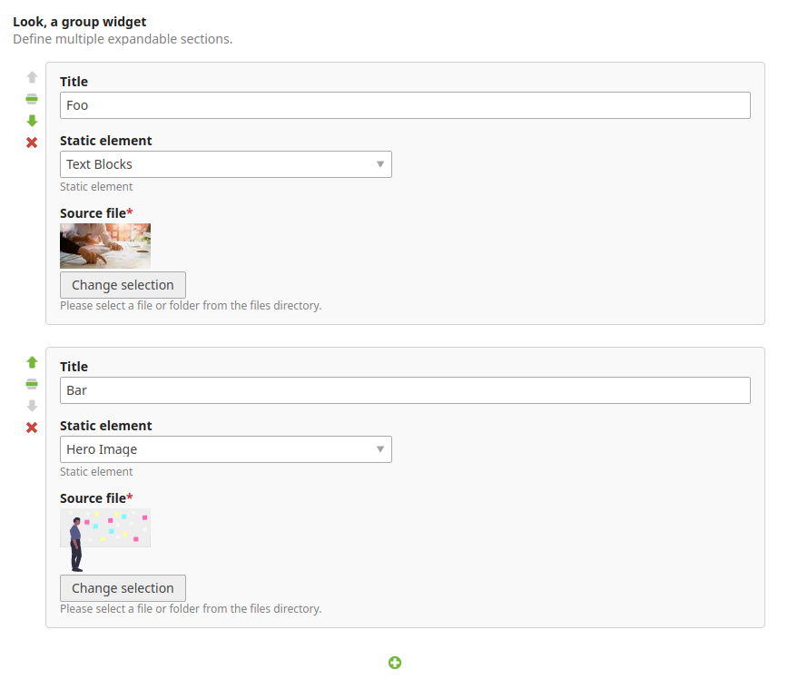

# contao-group-widget

[![Latest version on packagist][icon-version]][packagist]

This Contao CMS extension provides an input type `group` that allows
repeatable groups of fields in the backend. The resulting data is either
stored as a serialized array or in a custom entity relationship (ORM).



#### Design decisions / Limitations
The group element widgets are still 'first class citizens' of the respective 
DCA. Only their definition will be made on the fly. This way we're not messing 
with the act of rendering and state of the displayed child widgets. As a 
result, adding new elements via the *plus* button will submit the 
current DCA form to add the new element.

Visual reordering of elements is done via the CSS `order` property. This way
`iframes` can be kept alive (the DOM won't change) which is especially helpful
when dealing with components like the `tinyMCE` rich text editor.

## Documentation
* [Data definition](docs/data-definition.md)
* Storage backends
   - [Serialized storage](docs/storage/serialized-storage.md) (default)
   - [Entity storage](docs/storage/entity-storage.md)
   - [Extending](docs/storage/extending.md)


## TLDR;
Just give me an example, ok?

```php
$GLOBALS['TL_DCA']['tl_content']['fields']['my_group'] = [
    'inputType' => 'group',
    'palette' => ['amount', 'singleSRC', 'text'],   
    'fields' => [
        'amount' => [ // additional field, defined inline
            'inputType' => 'text',
            'eval' => ['tl_class' => 'w50'],
        ],
        '&singleSRC' => [ // let's change some properties of the existing field
            'eval' => ['mandatory' => false],
        ]   
    ],   
    
    // force at least 1, at max 5 elements
    'min' => 1,
    'max' => 5,
    
    // disable ordering (on by default)
    'order' => 'false',
    
    // store serialized into a blob (default storage backend)
    'sql' => [
        'type' => 'blob',
        'length' => \Doctrine\DBAL\Platforms\MySqlPlatform::LENGTH_LIMIT_BLOB,
        'notnull' => false,
    ],
];
```


[icon-version]: https://img.shields.io/packagist/v/mvo/contao-group-widget.svg?style=flat-square
[packagist]: https://packagist.org/packages/mvo/contao-group-widget
